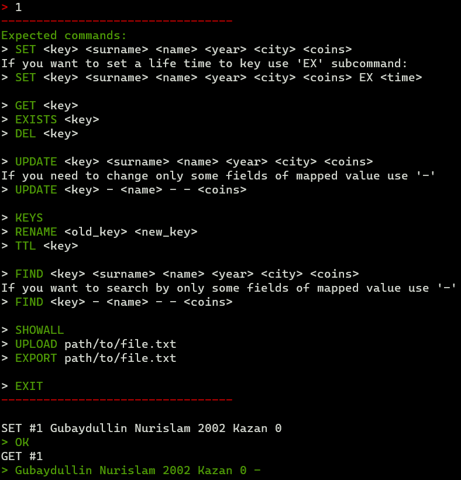

# In-Memory-Key-Value-Storages-CPP

## Install

---
To install the In-Memory-Key-Value-Storages-CPP, follow these steps:

1. Clone or download repository.

```shell
git clone https://github.com/tonitaga/In-Memory-Key-Value-Storages-CPP.git
```

2. Ensure you have the g++ compiler installed on your system.
3. Build & Test

```shell
make all
```

or use target only for build

```shell
make build
```

4. Run the program

```shell
make run
```

## Preview

---

### View Choice

---


### Storage interactive work view

---



### Storages compare view

---


### Key-Value generation view

---

